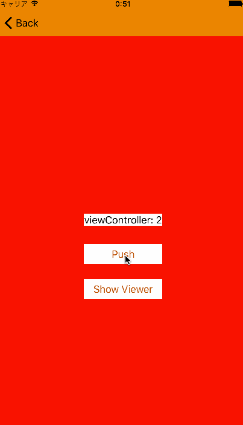
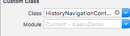

# Kaeru

**Kaeru** can switch ViewController in NavigationController like iOS task manager UI (after iOS 9).

## Movie


## Usage
You can use `HistoryNavigationController`, that sub class of `UINavigationController`. It can be used like `UINavigationController`.

### e.g
#### On storyboard  
##### If you install through CocoaPods.


##### If you install through download or git clone.


#### Swift code in AppDelegate
```
func application(application: UIApplication, didFinishLaunchingWithOptions launchOptions: [NSObject: AnyObject]?) -> Bool {
    // Override point for customization after application launch.

    let viewContoller = UIViewController()
    let navigationController = HistoryNavigationController(rootViewController: viewContoller)

    window?.rootViewController = navigationController

    window?.makeKeyAndVisible()

    return true
}
```

And you can call `self.navigationController?.presentHistory()` in UIViewController sub class. After it, appearance would change like iOS task manager UI.

```
@IBAction func showViewerButtonPressed(sender: AnyObject) {
    navigationController?.presentHistory()
}
```

And it's possible tap each ViewController snap shots.
After it, begin scale animation and called automatically  `UINavigationContoller.popToViewController`.

## Customize
When called `HistoryNavigationController.presentHistory()`,
it's possible to set a custom `backgroundView`.

```
let view = UIView(frame: UIScreen.mainScreen().bounds)
view.backgroundColor = .redColor()
navigationController?.presentHistory(view)
```

This sample code write and run, when `HistoryNavigationController` appear, background becomes red.

## TODO
- [x] Support cocoapods.
- [x] Support Carthage.
- [ ] Add delegate methods.
- [ ] Test.


## License

**Kaeru** is available under the MIT license. See the **LICENSE** file for more info.
